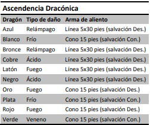

# Dracónido

Nacido de los dragones, como su nombre proclama, el dracónido camina orgulloso a través de un mundo que le recibe
lleno de miedo e incomprensión. Modelado por los dioses
dracónidos o por los dragones mismos, el dracónido originalmente nacía de huevos de dragón como una raza única, combinando los mejores atributos de los dragones y los humanoides. Algunos dracónidos son fieles sirvientes de los verdaderos dragones, otros forman parte de ejércitos en grandes guerras e incluso otros se encuentran a la deriva, sin una visión
clara de la vida.

## Atributos raciales

Tu herencia dracónica se manifiesta en una variedad de rasgos que compartes con otros dracónidos.

- Incremento de Puntuación de Característica. Tu puntuación de fuerza se incrementa en 2 y tu puntuación de carisma se incrementa en 1.

- Edad. Los dracónidos jóvenes crecen rápidamente. Caminan horas después de nacer y alcanzan el tamaño y desarrollo
de un niño humano de 10 años a los 3, alcanzan la adultez a
los 15. Viven alrededor de 80 años.

- Alineamiento. Los dracónidos tienden a los extremos,
haciendo una decisión consciente por un bando u otro en la
guerra cósmica entre el bien y el mal (representada por Bahamut y Tiamat, respectivamente). Muchos dracónidos son buenos, pero aquellos que eligen el lado de Tiamat pueden ser
terribles villanos.

- Tamaño. Los dracónidos son más altos y pesados que los
humanos, sobrepasando los 6 pies (1,8 m) de altura y pesando de media alrededor de las 250 libras (115 kg). Tu tamaño es mediano.

- Velocidad. Tu velocidad base a pie es de 30 pies.

- Ascendencia Dracónica. Tienes ascendencia dracónica,
elige un tipo de dragón de la tabla Ascendencia Dracónica. Tu
arma de aliento y tu resistencia al daño están determinados
por el tipo de dragón, tal como se muestra en la tabla.

- Arma de Aliento. Puedes usar tu acción para exhalar
energía destructiva. Tu ascendencia dracónica determina el
tamaño, forma y tipo de daño de la exhalación.
Cuando usas tu arma de aliento, todas las criaturas en el
área de la exhalación deben hacer una tirada de salvación, el
tipo de la cual está determinado por tu ascendencia dracónica. La CD para esta tirada de salvación es 8 + tu modificador de Constitución + tu bono de competencia. Una criatura
recibe 2d6 de daño si falla la tirada y la mitad de ese daño si
la supera. El daño se incrementa a 3d6 a nivel 6, 4d6 a nivel
11 y 5d6 a nivel 16.
Tras usar tu arma de aliento no puedes volver a usarla
hasta completar un descanso corto o prolongado.

- Resistencia al Daño. Tienes resistencia a un tipo de daño
asociado con tu ascendencia dracónica.

- Idiomas. Puedes hablar, leer y escribir Común y Dracónico. Se cree que el dracónico es una de los idiomas más antiguos y a menudo se usa en el estudio de la magia. El idioma
suena áspero para muchas otras criaturas e incluye numerosas consonantes fuertes y sibilantes.

## Subrazas (Asendencia)

[Readme.md](README.md)